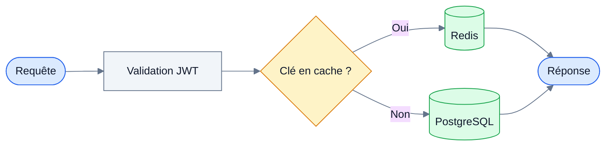

# Mermaid diagrams

Load this reference only when the document contains — or should contain — a diagram.

## When a diagram earns its place

| Situation | Diagram |
| --- | --- |
| Flow or process, 3+ steps | `flowchart` |
| Exchange between 2+ actors or services | `sequenceDiagram` |
| Data model, 2+ linked entities | `erDiagram` |
| Lifecycle, state machine | `stateDiagram-v2` |
| Dated milestones | `gantt` |

Otherwise: no diagram. One that does not replace text is noise.

## Design rules — legible at a glance

- **12 nodes maximum.** Beyond that, split in two or raise the abstraction level.
- **Direction**: `LR` for a pipeline or temporal flow, `TD` for a hierarchy or decision tree.
- **Semantic shapes**, always the same:
  `([Début/Fin])` · `[Traitement]` · `{Décision}` · `[(Base de données)]` ·
  `[[Sous-système]]` · `[/Entrée-Sortie/]`
- **Edge labels** of 3 words maximum, in French.
- **`subgraph`** to group by domain or layer. Four maximum.
- **`classDef`** for color: 4 semantic classes maximum, never decorative color applied node by node.
- One diagram per H2 section. One sentence right before it saying what it shows — that sentence is the text equivalent.

## Imposed palette

Use `theme: 'base'` and declare **fill AND color** on every class. Without an explicit text
color the diagram becomes unreadable in dark mode on GitHub.

| Role | Fill | Stroke |
| --- | --- | --- |
| Entrée / sortie | `#DBEAFE` | `#2563EB` |
| Traitement | `#F1F5F9` | `#64748B` |
| Décision | `#FEF3C7` | `#D97706` |
| Données | `#DCFCE7` | `#16A34A` |

Text is always `#0F172A`. Contrast verified ≥ 4.5:1 on all four fills.
